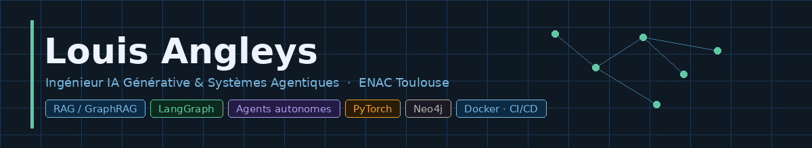

  

---

Ingénieur diplômé de l'ENAC (École Nationale de l'Aviation Civile), je me spécialise dans la conception de systèmes IA orientés production : pipelines RAG/GraphRAG, agents autonomes, observabilité. Mon parcours mêle formation d'ingénieur classique — algorithmique, réseaux, mécanique du vol — à une pratique intensive de l'écosystème LLM depuis 2023.

Ce qui me motive vraiment : appliquer ces outils à des problèmes industriels concrets, en particulier dans l'aéronautique où les enjeux de **décarbonation** sont massifs et où la data reste encore largement sous-exploitée. Réduire l'empreinte carbone d'un vol de quelques pourcents à l'échelle d'une flotte, c'est un impact réel — et c'est le genre de problème où physique, données et IA se rejoignent.

Je cherche une première opportunité (CDI, V.I.E, ou expérience à l'international) pour mettre ces compétences au service de projets ambitieux.

---

## Ce sur quoi je travaille

### GraphRAG — Groupe ADP `Stage PFE · 6 mois · Orly`

Durant mon stage de fin d'études au sein de la Direction Innovation du Groupe ADP (Aéroports de Paris), j'ai conçu un système **GraphRAG** de bout en bout pour optimiser des processus métiers complexes.

Le problème de départ : les systèmes RAG vectoriels classiques échouent sur les requêtes "multi-hop" — celles qui nécessitent de traverser plusieurs documents liés pour construire une réponse. Par exemple : *"Quelles procédures de maintenance sont impactées par ce nouveau marché de signalisation ?"* implique de relier un marché à des équipements, puis des équipements à des manuels — une chaîne de causalité qu'un RAG vectoriel ne voit pas.

La solution : remplacer la recherche vectorielle pure par un **graphe de connaissances** (Neo4j, puis Apache AGE en pré-production), et orchestrer la récupération via un pipeline **ReAct** qui raisonne sur la nécessité d'aller chercher des informations complémentaires dans le graphe. Résultat sur notre golden dataset interne : **55% → 80% de correctness** sur les requêtes multi-hop.

→ Architecture, choix techniques et leçons apprises : [`graphrag-pipeline`](https://github.com/louisangl/graphrag-pipeline)

---

### Aircraft Fuel Digital Twin `En cours`

Projet personnel à la croisée de ma formation aéronautique et de mes intérêts pour la décarbonation. L'idée : construire un **jumeau numérique** de consommation carburant d'un aéronef à partir de données de vol réelles.

Ingestion des trajectoires ADS-B via l'API OpenSky Network, puis application d'un modèle physique maison — équations de traînée, poussée et variation de masse — pour reconstituer la consommation litre par litre et estimer l'empreinte CO₂ par vol. À terme : comparer des scénarios de trajectoire alternatifs sur leur impact environnemental, et explorer un couplage avec un modèle ML pour la prédiction.

---

### Chatbot LLM orienté production `En cours`

Stack MLOps légère autour d'un chatbot LLM : inférence **Groq**, observabilité complète via **Langfuse** (traces, évaluations, coûts), architecture modulaire pensée pour l'itération rapide. L'objectif est moins le chatbot lui-même que la stack de monitoring et d'évaluation autour — ce qui manque dans la plupart des projets LLM publics.

---

### PINNs — Physics-Informed Neural Networks `Exploration`

Réseaux de neurones contraints par des équations différentielles, appliqués à des problèmes de dynamique de vol. L'idée : ne pas traiter la physique comme une boîte noire mais en faire une contrainte explicite dans la loss. PyTorch.

---
 
## Stack
 
**Langages & backend**  

 
**Data & bases**  

 
**ML & IA**  

 
**Observabilité & infra**  

 

## Projets académiques

Projets réalisés à l'ENAC (Toulouse) et à la Sapienza Università di Roma (Erasmus 2024). Détails et code dans [`academic-projects`](https://github.com/louisangl/academic-projects).

- **Optimisation de trajectoires par algorithme génétique** — optimisation 2D en espace contraint, programmation fonctionnelle, ENAC
- **Simulation de trafic aérien Java / MCTS** — moteur de simulation avec agents décisionnels, méthode Agile, ENAC
- **Cinématique inverse par réseau de neurones** — apprentissage de la fonction inverse position → angles, PyTorch, Sapienza di Roma

---

## Ailleurs

En dehors du code, je suis de près les marchés financiers — analyse macro, stratégies de couverture, comportement des actifs en période de stress. Un autre terrain où les données et le raisonnement structuré font la différence.

Je voyage quand je peux (Colombie, Chine, États-Unis), je fais du calisthenics, du tennis et du trail.

---

## Contact

&nbsp;
